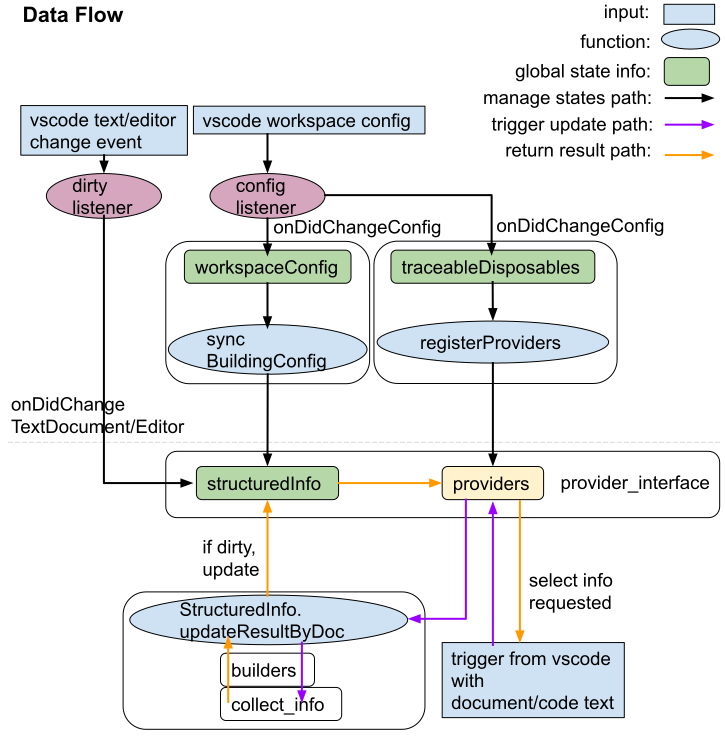

# Developer Guide
Welcome, and thank you for your interest in this project!  
Hoping this guide will be helpful to you whether you would like to contribute, fork, or learn this repository :)

## Architecture  
Let us first take a brief look at the design of this project.  

  

The image above shows the layers of the source code. `entry` initializes the extension and applies the vscode workspace configuration to the extension. `provider_interface` registers the providers in vscode. `builders` prepares the data structures from the raw text string/processed semantic information for vscode language features. `collect_info` collects the semantic information from the raw text string. `common` includes some constants and algorithms. `doc` is the interface for getting documentation.  

## Data Flow 

  

Please do not trust the correspondence between naming in the data flow diagram and naming in the source code since the naming in the source code is subject to change.  

## How it works 

### Global State Manager Part
This part is above the dashed line in the Data Flow diagram. `entry` includes this part.  
The config listener will listen to the config change from vscode. Then, the config listener will call other functions to register the correct providers and pass the building config to `structuredInfo`. If you are interested in the configuration of this extension, see
[Configuration](https://github.com/qingpeng9802/vscode-common-lisp/wiki/Configuration).  
Also, the dirty listener will set the dirty flag to true in `structuredInfo` when a text/editor change event is received.  

### Core Functionality Part
This part is below the dashed line in the Data Flow diagram. The core functionality is in this part. First, if you are not familiar with vscode extension, please just check [patterns-and-principles](https://vscode-docs.readthedocs.io/en/stable/extensions/patterns-and-principles/) and [programmatic-language-features](https://code.visualstudio.com/api/language-extensions/programmatic-language-features).  
When vscode requests language information from a provider, the provider will call `produceResultByDoc` to get updated semantic information. Then, the provider will return the information to vscode. If you are interested in how the provider works, you can check the samples in [vscode-extension-samples samples](https://github.com/microsoft/vscode-extension-samples#samples) which used API `languages.`  
  
## Version Control
The version number is in the format MAJOR.MINOR.PATCH. We do not comply with the *Semantic Versioning* strictly. We save x.x.0 for the *alpha version* and x.x.1 for the *beta version*.  

## Compile & Package 

### Setup  

Run `npm install`  

### Compile

Run `npm run esbuildc` for compile once;  
Run `npm run esbuildw` for watch mode;  
Run `npm run esbuildp` for production.  

> Please remember to execute `npm run tscc` for TypeScript type checking separately.  

For more commands, check them in `"scripts"` in `package.json`.

Note that we are trying to use `esbuild` as the bundler since it is faster than `webpack`. However, we still keep `webpack` for `vsce package`.  

`Parcel` shows worse performance than `webpack` in this project, but the cli commands are saved below for those who might be interested. Maybe we will try `swcpack` in the future.  
```json
"parcelc": "parcel build ./src/web/extension.ts --dist-dir ./dist/web --no-optimize",
"parcelw": "parcel watch ./src/web/extension.ts --dist-dir ./dist/web --no-optimize",
"parcelp": "parcel build ./src/web/extension.ts --dist-dir ./dist/web --no-source-maps",
```

### Linting
Run `npm run lint` for linting.  
Most errors and warnings can be fixed automatically by running `npm run lint -- --fix`. 

### Test
There are no tests now. The features of this project are still changing. Most of the time needs to be allocated for polishing the features.  

### Package vsix
Run `npm i -g vsce` to install `vsce` globally since `vsce` is not in the `package.json`.  

Run `vsce package`.  
Then, you will get a `common-lisp-x.x.x.vsix` in your `./` .

If you would like to use the packaged `.vsix` extension, you can load the `.vsix` extension to vscode by referring to [extension-marketplace install-from-a-vsix](https://code.visualstudio.com/docs/editor/extension-marketplace#_install-from-a-vsix).  

## Code Style  
We are trying to write dumb code. TypeScript has many fancy syntax features, however, we would not like to use them too much. We are trying to maintain the best readability while utilizing some useful syntax features.

We do not use `prettier` in the linter, and the reason is basically [Why I don't use Prettier_antfu](https://antfu.me/posts/why-not-prettier).  

According to [The Art of Unix Programming, Chapter 4. Modularity, Encapsulation and Optimal Module Size](http://catb.org/esr/writings/taoup/html/ch04s01.html),
we are trying to keep <200 logical lines of code and <400 physical lines of code per file for maintainability.  
Run `find ./src -name '*.ts' | xargs wc -l` to check the physical lines of code of `./src`.
 