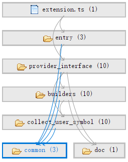

# Developer Guide
Welcome, and thank you for your interest in this project!  
Hoping this guide will be helpful to you whether you would like to contribute, fork or learn this repository :)

## Architecture  
Let us first take a brief look at the design of this project.  

  

The image above shows the layers of the source code. `entry` initializes the extension and makes the workspace configuration take effect within the extension. `provider_interface` provides the providers for registering in vscode. `builders` prepares the data structures for the vscode language feature from the raw text string/processed semantic information. `collect_user_symbol` collects the semantic information from the raw text string. `common` includes some constants and algorithm. `doc` is the interface for getting document information.  

## Data Flow 

## How it works 


Please do not trust the correspondence between naming in the data flow diagram and naming in the source code since the naming in the source code is subject to change.  
[patterns-and-principles](https://vscode-docs.readthedocs.io/en/stable/extensions/patterns-and-principles/)  
[programmatic-language-features](https://code.visualstudio.com/api/language-extensions/programmatic-language-features)  
[vscode-extension-samples samples](https://github.com/microsoft/vscode-extension-samples#samples)  

If you are interested in the configuration of this extension, see
[Configuration](https://github.com/qingpeng9802/vscode-common-lisp/wiki/Configuration).
## Version Control
The version number is in the format MAJOR.MINOR.PATCH. We do not comply the *Semantic Versioning* strictly. We save x.x.0 for the *alpha version* and x.x.1 for the *beta version*.  

## Compile & Package 

### Setup  

Run `npm install`  

### Compile

Run `npm run esbuildc` for compile once;  
Run `npm run esbuildw` for watch mode;  
Run `npm run esbuildp` for production.  

> Please be careful to execute `npm run tscc` for TypeScript type checking separately.  

For more command, check them in `"scripts"` in `package.json`.

Note that we are trying to use `esbuild` as the bundler, since it is faster than `webpack`. However, we still keep `webpack` for `vsce package`.  


`Parcel` shows worse performance than `webpack`, but the cli command are saved below for those who might be interested. Maybe we will try `swcpack` in the future.  
```json
"parcelc": "parcel build ./src/web/extension.ts --dist-dir ./dist/web --no-optimize",
"parcelw": "parcel watch ./src/web/extension.ts --dist-dir ./dist/web --no-optimize",
"parcelp": "parcel build ./src/web/extension.ts --dist-dir ./dist/web --no-source-maps",
```

### Linting
Run `npm run lint` for linting.  
Most errors and warnings are able to be fixed automatically by run `npm run lint -- --fix`. 

### Test
There is no tests now. The features in this project are still changing. Most of the time needs to be allocated for polishing the features.  

### Package vsix
Run `npm i -g vsce` to install `vsce` globally since `vsce` is not in the `package.json`.  

Run `vsce package`.  
Then, you will get a `common-lisp-x.x.x.vsix` in your `./` .

If you would like to use the packaged `.vsix` extension, you can load the `.vsix` extension to vscode by refering to [extension-marketplace install-from-a-vsix](https://code.visualstudio.com/docs/editor/extension-marketplace#_install-from-a-vsix).  


## Code Style  
We do not use `prettier` in the linter, and the reason is basically [Why I don't use Prettier_antfu](https://antfu.me/posts/why-not-prettier).  

Just write dumb code. TypeScript has many fancy syntax features, however, we would not like to use them too much. We are trying to maintain best readability while utilizing some useful syntax features.  

According to [The Art of Unix Programming, Chapter 4. Modularity, Encapsulation and Optimal Module Size](http://catb.org/esr/writings/taoup/html/ch04s01.html),
we are trying to keep <200 logical lines of code and <400 physical lines of code per file.  
Run `find ./src -name '*.ts' | xargs wc -l` to check the physical lines of code of `./src`.
 
