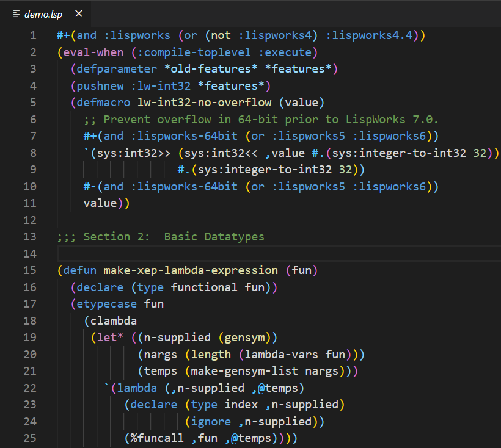
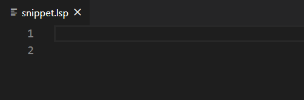

# Common Lisp language support for VS Code
This VS code extension supports syntax highlighting and snippets for Common Lisp.  

## Features

### Syntax Highlighting

### Snippets

## Usage and Recommendation
Beginner's Guide: https://code.visualstudio.com/docs/languages/overview  

Quick Guide:  

The language identifier(id) is `commonlisp`  
File Types: `lisp`, `lsp`, `l`, `cl`, and you can add more by yourself: https://code.visualstudio.com/docs/languages/overview#_adding-a-file-extension-to-a-language

|Kind of Symbol|Color|
|-|-|
|Macro, Declaration                                        | Blue
|Special Operator                                          | Purple
|Constant Variable                                         | light Blue
|Accessor, Functions, Standard Generic Function            | Yellow
|Class, Condition Type, System Class, Type, Type Specifier | Green

Snippets support: `defun`, `if`, `cond`, `let`, `let*`, `lambda`

The demos above are using Bracket Pair Colorizer 2. Use this extension with [Bracket Pair Colorizer 2](https://marketplace.visualstudio.com/items?itemName=CoenraadS.bracket-pair-colorizer-2) to get colorizing matching brackets.

## Design
Because of the funtional features of Common Lisp, we use the intuition of Common Lisp to design syntax highlighting instead of the intuition of non-functional language to design syntax highlighting. That is, we strictly follow the CL-ANSI 1.4.4.14 to classify the 978 external symbols in COMMON-LISP package. 

We processed [Common Lisp HyperSpec](http://www.lispworks.com/documentation/HyperSpec/Front/) to get the kind of each symbol. The result is in `./assets/COMMON-LISP-symbols.csv`, and please feel free to reuse the result :)  

We assign different colors to different kind of symbols, the assignment rule can be found in the start comment of `./syntaxes/commonlisp.tmLanguage`. This file includes comments (related info in `CL-ANSI`) for all rules. 

## Acknowledgement
draft proposed American National Standard for Information Systems—Programming Language—Common Lisp X3J13/94-101R [(CL-ANSI)](https://franz.com/support/documentation/cl-ansi-standard-draft-w-sidebar.pdf)  
[Common Lisp HyperSpec](http://www.lispworks.com/documentation/HyperSpec/Front/)  
[vscode-scheme](https://github.com/sjhuangx/vscode-scheme)  
https://github.com/egrachev/sublime-scheme/blob/master/Scheme.tmLanguage   
https://github.com/bradrobertson/sublime-packages/blob/master/Lisp/Lisp.tmLanguage  
The `icon.png` is from [Common-Lisp.net](https://common-lisp.net/) and resized, and is used under [Attribution 4.0 International (CC BY 4.0)](https://creativecommons.org/licenses/by/4.0/)  
The code segment in `Syntax Highlighting` is from [SBCL Repository](https://github.com/sbcl/sbcl)  
